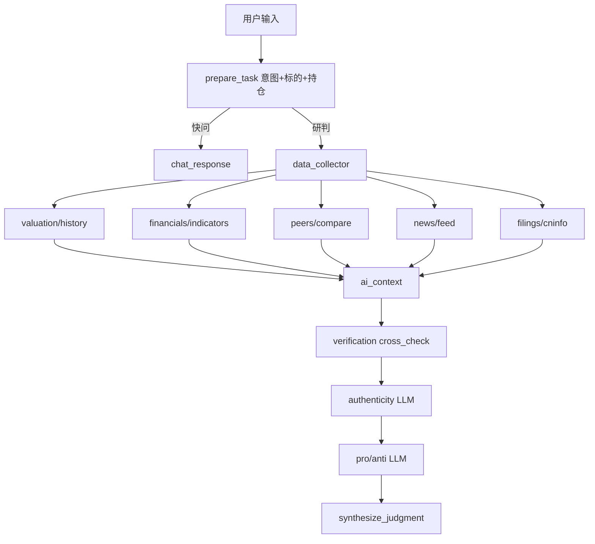

# PR-010：A 股免费数据深化与研判能力增强

| 字段 | 内容 |
|------|------|
| 对应分支 | `feat/pr010-a-share-free-data` |
| GitHub | 待创建 |
| 类型 | 功能 / 数据 / 分析 |
| 里程碑 | M4 |
| 依赖 | PR-007（Tools + ai_context）、PR-008（SQLite 对话持久化） |

---

## 1. 背景与目标

### 1.1 背景

PR-007～PR-008 完成后，FinTeam 已具备：

- 主 Agent + 7 子 Agent 编排（买入 / 卖出 / 验真流水线 + 快问快答）
- 免费数据栈雏形：AKShare 行情估值、巨潮法定公告、可选东财资讯列表
- `ai_context` 多源合并、`content_cache` 本地缓存、CopilotKit 历史对话

但对照 A 股个人投研场景与金融产品能力矩阵，仍存在明显短板：

1. **数据吃不满**：`stock_value_em` 仅取 `tail(1)`，无 PE/PB 历史序列与分位，无法满足「估值贵不贵」「近一年走势」类问题
2. **子 Agent 偏模板**：辩论 / 验真多为固定文案 + 规则打标，未基于 `ai_context` 做 LLM 深度分析
3. **核查不真实**：`verification` 未做多免费源交叉对账
4. **标的识别弱**：意图解析依赖关键词，代码别名仅硬编码 3 只
5. **基本面浅**：缺财报指标趋势、同业横向对比
6. **卖出情境缺持仓**：用户说「盈利 40% 是否减仓」无法带入成本与盈亏

产品定位已明确：**仅做 A 股个股分析，数据尽可能免费，本地自用，不构成投资建议**。

### 1.2 产品目标

1. **免费数据优先**：默认仅依赖 AKShare + 巨潮 + 东财公开列表 + 本地缓存；Finnhub / iTick 降为可选备选
2. **结论可溯源**：事实性陈述附带数据源与时间；推断类明确标注 `model_inference`
3. **研判有深度**：估值分位、财报摘要、同业对比、公告事件解读进入 `ai_context` 与子 Agent 输出
4. **体验可预期**：快问 30s 内返回；完整 pipeline 有阶段进度；支持任务取消
5. **范围聚焦 A 股**：不扩展基金、港股美股、宏观专题、量化回测平台

### 1.3 非目标（本 PR 明确不做）

- **文件问答**：不上传 PDF/Word/持仓报告文件解析、不做公告 PDF 全文 RAG 问答、不做「对着文档提问」
- 基金 / ETF / 债券 / 期货 / 港美股
- Wind / iFinD / Tushare Pro 等商业数据接入
- 自动下单、调仓、实盘交易
- 多用户登录、生产级合规审计、C 端公开发布
- 完整 DCF 建模平台、系统化量化回测
- CopilotKit 云同步

---

## 2. 目标用户与核心场景

### 2.1 目标用户

| 维度 | 描述 |
|------|------|
| 用户 | 个人投资者 / 业余投研者（本地自用） |
| 技能 | 能读行情与基本财务指标 |
| 诉求 | 多视角、有依据的 A 股研判草稿，而非直接买卖指令 |
| 约束 | 数据免费或低成本；API Key 仅 LLM（Gemini 免费层） |

### 2.2 核心场景

**场景 A：估值快问**

> 用户：「600519 近一年 PE 走势怎么样？当前估值贵不贵？」

系统：`data_query` 快路径 → 拉取 AKShare 历史估值序列 → 计算分位 → `ai_context` + LLM 回答，附数据源与交易日。

**场景 B：买入研判（增强）**

> 用户：「分析贵州茅台是否值得买入」

系统：流水线取数（含估值分位 + 财报指标 + 同业 2～3 家）→ 多源核查 → LLM 辩论 → 主 Agent 终裁。

**场景 C：卖出 / 减仓（含持仓）**

> 用户：「我持仓 300750 成本 180，现价多少？盈利不少，是否减仓？」

系统：解析持仓成本 → 拉行情算盈亏 → 走卖出 pipeline → 终裁含持仓情境说明。

**场景 D：公告 / 资讯事件**

> 用户：「600519 最近有什么重要公告？影响是什么？」

系统：巨潮公告列表 + 东财资讯 → LLM 输出「事件一句话 + 来源」，不做 PDF 全文问答。

**场景 E：验真（文本输入，非文件）**

> 用户：「听说 XX 公司获重大订单，帮我核实」

系统：标的解析 → 资讯 + 公告关键词交叉 → `authenticity` LLM 研判 → 必要时 HITL。

---

## 3. 用户故事与验收标准

| ID | 用户故事 | 验收标准 |
|----|----------|----------|
| US-10-01 | 我想知道标的估值在历史中的位置 | 给定 A 股代码，30s 内返回 PE-TTM / PB 当前值、近 1 年分位（0–100%）、简要解读；数据标注 AKShare + 交易日 |
| US-10-02 | 我想看近一年估值走势 | 快问返回至少 6 个采样点的 PE 或 PB 序列（表格或列表），非仅最后一行 |
| US-10-03 | 买入研判的辩论要有真实依据 | `pro_buy` / `anti_buy` 每条核心论点引用 `ai_context` 或 verified claim；禁止纯固定模板句 |
| US-10-04 | 数据要经过交叉核查 | `verification` 对比 AKShare 收盘价与日线收盘价、估值字段一致性；不一致写入 `discrepancies` |
| US-10-05 | 任意 A 股代码或常用名称可识别 | 输入 6 位代码或股票简称（全市场表）可解析标的；不再依赖仅 3 个硬编码别名 |
| US-10-06 | 资讯默认可用且免费 | `.env` 默认推荐 `NEWS_FETCH_ENABLED=true`；无 Finnhub Key 时东财列表仍可返回资讯 |
| US-10-07 | 基本面更深一点 | `ai_context` 含最近 2～4 期营收/净利同比（AKShare 财务分析指标）；缺失时标注 |
| US-10-08 | 同业简单对比 | 买入/卖出 pipeline 可选产出同行业 2～3 家 PE/PB 对比一行表 |
| US-10-09 | 卖出情境可带持仓成本 | 用户消息含「成本/买入价/持仓价」时写入 state；终裁报告含盈亏比例 |
| US-10-10 | 公告有影响解读 | 近 90 天巨潮公告标题经 LLM 归纳「事件 + 可能影响」，附公告链接 |
| US-10-11 | 长任务可取消 | 前端提供「取消分析」；调用 `cancel_task`，状态变为 `cancelled` |
| US-10-12 | 配置纯免费数据栈可跑通 | `A_SHARE_MARKET_PROVIDER=akshare`、不配 Finnhub/iTick，完整买入研判可完成 |

---

## 4. 免费数据策略

### 4.1 默认数据栈（零付费）

| 数据类型 | 主源 | 费用 | 备注 |
|----------|------|------|------|
| 实时/日线行情 | AKShare `stock_zh_a_daily` | 免费 | 已有 |
| 估值序列 | AKShare `stock_value_em` | 免费 | **本 PR 吃满全量历史** |
| 估值快照字段 | 同上（PE/PB/PEG/PS/市值） | 免费 | 已有，需写入 ai_context |
| 财务分析指标 | AKShare `stock_financial_analysis_indicator_em` | 免费 | 新增 |
| 行业信息 | AKShare `stock_individual_info_em` | 免费 | 新增，用于同业 |
| 同业 spot | AKShare `stock_zh_a_spot_em` | 免费 | 新增，按行业筛 2～3 家 |
| 法定公告 | 巨潮 CNINFO 公开接口 | 免费 | 已有 |
| 资讯列表 | 东财公开列表 | 免费 | 已有，**默认开启** |
| 代码表 | AKShare `stock_info_a_code_name` | 免费 | 新增 |
| 交叉核查备选 | Ashare（vendored） | 免费 | 已有，仅对账用 |

### 4.2 可选降级（非默认）

| 来源 | 场景 |
|------|------|
| Finnhub | 有 Key 时合并资讯 |
| iTick | AKShare 失败时备选行情 |

### 4.3 推荐 `.env`（文档与 example 同步）

```bash
A_SHARE_MARKET_PROVIDER=akshare
FILINGS_FETCH_ENABLED=true
NEWS_FETCH_ENABLED=true
# FINNHUB_API_KEY=          # 可选
# ITICK_TOKEN=              # 可选
GEMINI_API_KEY=...          # 分析必需，免费层可用
```

---

## 5. 系统架构变更

### 5.1 Tools 层新增模块

```
tools/
  valuation/
    history.py      # stock_value_em 全量 + 分位计算
    percentile.py   # PE/PB 历史分位工具函数
  financials/
    indicators.py   # 财务分析指标（营收/净利同比等）
  peers/
    compare.py      # 同行业 2～3 家估值对比
  symbols/
    resolve.py      # 全市场代码表解析（或扩展现有 symbols.py）
  verification/
    cross_check.py  # 多源对账逻辑
```

### 5.2 编排变更（MainAgent）

- `prepare_task`：增强标的解析（全市场表）+ 从用户文本抽取 `cost_price` / `position_qty`（正则，可选）
- `chat_response` / `data_collector`：注入 `valuation_context`、`financials_indicators`、`peers_context`
- `verification`：调用 `cross_check`，输出真实 `discrepancies`
- `pro_*` / `anti_*` / `authenticity`：LLM 生成（有 Key），无 Key 时结构化降级 + 明确提示
- 新增前端取消入口 → `cancel_task`

### 5.3 数据流（增强后）



---

## 6. 分阶段交付（开发顺序）

### Phase A — 估值历史与分位（P0）

**改动**

- `tools/valuation/history.py`：`fetch_valuation_history(symbol, days=365)`
- `tools/valuation/percentile.py`：当前 PE/PB 在近 N 日样本中的分位
- 扩展 `build_analysis_context` → `build_valuation_context`
- `GET /tools/valuation?symbol=600519`（Frontend Tool 可选）
- `data_collector` / `chat_response` 注入估值分位段落

**验收**

- US-10-01、US-10-02、US-10-12

### Phase B — 子 Agent LLM 化 + 交叉核查（P0）

**改动**

- `tools/verification/cross_check.py`：AKShare 多字段一致性 + Ashare 价格可选对账
- 重写 `agents/verification/runner.py` 使用 cross_check 结果
- `agents/pro_buy|anti_buy|pro_sell|anti_sell/runner.py`：LLM + `ai_context` + verified claims
- `agents/authenticity/runner.py`：LLM 研判存疑项（非仅 model_inference 规则）
- 无 `GEMINI_API_KEY` 时保留结构化降级文案

**验收**

- US-10-03、US-10-04

### Phase C — 全市场标的 + 资讯默认免费（P1）

**改动**

- 扩展 `tools/symbols.py`：启动时或首次请求加载 `stock_info_a_code_name`（带缓存）
- 更新 `agents/shared/intent.py`：解析结果走统一 `resolve_a_share`
- `.env.example` 默认说明 `NEWS_FETCH_ENABLED=true`
- README / 对话 initial 文案更新为「纯 AKShare 栈」

**验收**

- US-10-05、US-10-06

### Phase D — 财报指标 + 同业对比 + 公告解读（P1）

**改动**

- `tools/financials/indicators.py`
- `tools/peers/compare.py`（同行业 2～3 家，超时则跳过）
- `tools/ai_context.py` 增加 `build_peers_context`、`build_indicators_context`
- `data_collector` 产出公告事件摘要（LLM 归纳标题，**不读 PDF**）
- 终裁 / 快问可引用同业表

**验收**

- US-10-07、US-10-08、US-10-10

### Phase E — 持仓情境 + 任务取消（P1）

**改动**

- `prepare_task` 解析 `cost_price`、`profit_pct`（用户文本或「成本 180」）
- `MainAgentState` 增加 `position: { cost_price?, quantity?, profit_pct? }`
- `synthesize_judgment` / 卖出辩论 prompt 注入持仓
- 前端 `FinTeamChat` 或 `AgentStatusPanel` 增加「取消分析」按钮
- `FinalReportPanel` 展示盈亏行（若有）

**验收**

- US-10-09、US-10-11

---

## 7. Agent / 子模块规格摘要

### 7.1 data_collector（增强）

| 输出 | 说明 |
|------|------|
| `metadata.ai_context` | 行情 + 估值分位 + 财报指标 + 同业 + 资讯 + 公告 |
| `metadata.valuation` | `{ pe_ttm, pb, pe_percentile_1y, pb_percentile_1y, series_sample[] }` |
| `claims[]` | 估值分位、营收同比等 verified 条目 |

### 7.2 verification（增强）

- 输入：`data_bundle`
- 逻辑：`cross_check` 比对价格、PE、交易日一致性
- 输出：`discrepancies[]` 非空时下调 `confidence`

### 7.3 辩论 Agent（增强）

- 输入：`verified_data` + `ai_context` 摘要
- LLM system prompt：仅引用 verified 事实；推断标注；多空各 ≥2 条可溯源论点
- 输出：`BullCase` / `BearCase` artifact，`metadata.thesis` + `claims[]`

### 7.4 authenticity（增强）

- 输入：资讯标题 + 公告标题列表 + verified claims
- 输出：存疑项与可信项；`has_suspicious` 仍可触发 HITL
- **不做**：用户上传截图 / 文件验真

---

## 8. 前端变更

| 组件 | 变更 |
|------|------|
| `FinTeamChat` | initial 文案：免费数据栈说明；可选展示估值分位卡片 |
| `AgentStatusPanel` | 取消按钮（`phase` 非 done/cancelled 时） |
| `FinalReportPanel` | 持仓盈亏、估值分位、同业对比小节（有数据时） |
| `DebatePanel` | 展示 `verified` 标记与来源 |
| 无新页面 | 不增加文件上传组件 |

---

## 9. API / 路由（后端 FastAPI）

| 路由 | 说明 |
|------|------|
| `GET /tools/valuation` | 估值历史 + 分位（供 Frontend Tool） |
| `GET /tools/indicators` | 财务分析指标 |
| `GET /tools/peers` | 同业对比 |
| 现有 `/tools/market`、`/tools/context` | 扩展返回字段，保持兼容 |

---

## 10. 合规与安全

- 资讯仍遵守 `tools/compliance.py` 域白名单（正文摘要默认关）
- 所有输出附 `DATA_USE_NOTICE` 与免责声明
- 公开接口请求间隔 `DATA_REQUEST_INTERVAL_SEC`（默认 0.5s）
- 全市场代码表缓存本地，不反复全量爬取
- **禁止**实现任意 URL / 用户上传文件的抓取与问答

---

## 11. 测试计划

| 用例 | 输入 | 期望 |
|------|------|------|
| T1 估值快问 | `600519 近一年 PE 走势` | 含序列 + 分位 + AKShare 来源 |
| T2 买入研判 | `分析比亚迪是否值得买入` | pipeline 完成；辩论非纯模板 |
| T3 纯免费栈 | 仅 `akshare` + 东财资讯，无 Finnhub | T2 可完成 |
| T4 标的解析 | `查一下隆基绿能行情` | 解析到正确代码 |
| T5 持仓卖出 | `300750 成本 180 是否减仓` | 终裁含盈亏估算 |
| T6 取消任务 | 研判中途点取消 | `phase=cancelled` |
| T7 无文件入口 | 全站无 upload | 无 `/upload`、无 file input |

---

## 12. 里程碑与合并建议

```
feat/pr010-a-share-free-data
  ├── Phase A  valuation
  ├── Phase B  agents-llm + cross_check
  ├── Phase C  symbols + news default
  ├── Phase D  indicators + peers + filing summary
  └── Phase E  position + cancel UI
```

建议 **单 PR 分次 commit**，每 Phase 可在 description 勾选；或 Phase A+B 先合并降低风险。

提交 message 示例：

```
feat(m4): AKShare 估值历史与分位 (#10)
feat(m4): 子 Agent LLM 化与交叉核查 (#10)
```

---

## 13. 验收总清单

- [ ] US-10-01～US-10-12 全部满足
- [ ] 默认免费数据栈文档化（`.env.example` + README）
- [ ] 无文件上传 / 文件问答相关代码与 UI
- [ ] `npm run build` 通过
- [ ] 后端现有测试 / 手动 pipeline 冒烟通过
- [ ] 大改后可选 `npx gitnexus analyze` 更新索引

---

## 14. 附录：与主 PRD 关系

- 本文档为 **M4 增量 PRD**，不替代 [`docs/prd/financial-team-agent-prd.md`](../prd/financial-team-agent-prd.md)
- M0～M3 范围以 PR-001～PR-008 为准；本文档覆盖 **PR-007 之后的能力债务清偿**
- 产品边界重申：**A 股个股、免费数据、本地自用、无文件问答**
