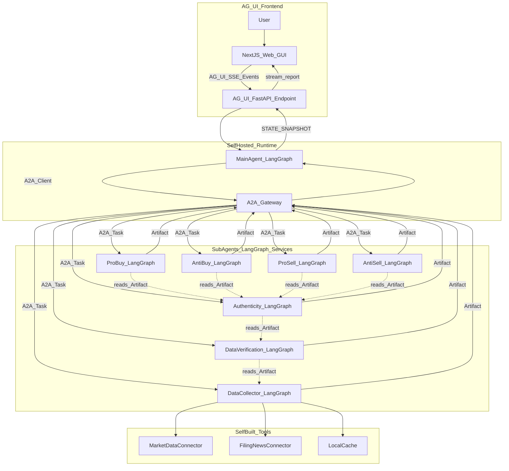

# FinTeam Agent 产品需求文档（PRD）

| 字段 | 内容 |
|------|------|
| 产品名称 | FinTeam Agent（金融投研团队 Agent） |
| 文档版本 | v0.1 Draft |
| 状态 | 待评审 |
| 目标用户 | 个人自用（投研 / 交易辅助） |
| 技术栈 | LangGraph + A2A + AG-UI + Next.js |

---

## 1. 背景与目标

### 1.1 背景

个人投研决策通常需要多角色协作：有人负责取数、有人交叉核对、有人验证信息真伪、有人从多空不同视角辩论，最后由负责人综合裁决。现实中一人难以同时扮演这些角色，且容易因信息源单一、未交叉验证或情绪化判断导致失误。

FinTeam Agent 旨在用软件模拟一支「虚拟投研团队」：多个专职子 Agent 分工协作，主 Agent 负责编排与终裁，用户通过 AG-UI 页面实时观察全流程并获取可溯源的综合研判报告。

### 1.2 产品目标

1. **可溯源**：所有事实性结论必须附带数据来源与时间戳；无法验证的内容明确标注「推断」或「模型生成」。
2. **多视角**：买入 / 不买入、卖出 / 不卖出等对立观点由独立子 Agent 产出，避免单一模型偏见。
3. **可观测**：用户可在 GUI 中看到流水线进度、各子 Agent 状态与辩论过程。
4. **自主可控**：主 Agent 与全部子 Agent 基于 LangGraph 自研，Agent 间用 A2A 协议通信，不依赖任何商业 Agent 平台。

### 1.3 非目标

- 不提供自动下单、自动调仓能力。
- 不面向 C 端公开发布（个人自用，合规要求简化但仍保留免责）。
- 不将第三方「黑盒投研 API」作为子 Agent 替代自研逻辑。
- MVP 阶段不追求覆盖全市场全品种，优先支持 A 股个股基本面 + 行情研判。

---

## 2. 目标用户与核心场景

### 2.1 目标用户

| 维度 | 描述 |
|------|------|
| 用户 | 个人投资者 / 业余投研者（本人使用） |
| 技能 | 具备基本金融常识，能阅读财报与行情数据 |
| 诉求 | 快速获得多视角、有依据的研判草稿，而非直接指令 |
| 约束 | 本地或私有部署，数据与 API Key 不出本机 |

### 2.2 核心场景

**场景 A：买入研判**

> 用户：「帮我分析贵州茅台（600519）当前是否值得买入？」

系统执行：取数 → 核查 → 验真 → 买入 / 不买入辩论 → 主 Agent 终裁 → AG-UI 展示报告。

**场景 B：卖出 / 减仓研判**

> 用户：「我持仓宁德时代（300750）已盈利 40%，是否该减仓？」

系统额外激活 ProSell / AntiSell 子 Agent，终裁报告包含持仓情境说明。

**场景 C：信息验真**

> 用户：「这条财经新闻说 XX 公司获得重大订单，帮我核实真伪。」

系统可走轻量路径：DataCollector → Verification → Authenticity，跳过辩论阶段，直接输出验真报告。

**场景 D：纯查数（快路径）**

> 用户：「茅台近一年 PE 走势？」

MainAgent 识别为查数意图，仅调度 DataCollector + Verification，30s 内返回表格，不触发辩论。

---

## 3. 用户故事与验收标准

| ID | 用户故事 | 验收标准 |
|----|----------|----------|
| US-01 | 作为用户，我想在网页上与 Agent 对话发起分析 | AG-UI 对话页支持流式输入输出；发起任务后 2s 内显示「规划中」状态 |
| US-02 | 作为用户，我想看到分析进行到哪一步 | 流水线进度条随 `phase` 更新；进度数值 0–100 与子 Agent 状态同步，延迟 <2s |
| US-03 | 作为用户，我想看到多空双方论据 | 辩论区展示 ProBuy / AntiBuy（及可选 ProSell / AntiSell）结构化卡片，每条论点带 `verified` 标记 |
| US-04 | 作为用户，我想获得一份综合研判 | 终裁报告含：摘要、已验证事实、多方观点、分歧、主 Agent 倾向、免责 |
| US-05 | 作为用户，当信息存疑时我希望参与确认 | 验真存疑时触发 Human-in-the-Loop，暂停流程直至用户点击「继续 / 终止」 |
| US-06 | 作为用户，我想回看历史研判 | 历史页列出 task_id、标的、时间、结论摘要；可展开完整报告 |
| US-07 | 作为用户，当某子 Agent 失败时仍希望得到部分结论 | 失败 Agent 在状态面板标红；终裁报告标注「缺失视角」并基于已有 Artifact 完成裁决 |

---

## 4. 系统架构

### 4.1 三层协议分工

| 协议 | 连接对象 | 职责 |
|------|----------|------|
| **AG-UI** | 用户 ↔ MainAgent | 对话、进度流、双向 State 同步、人机确认、报告展示 |
| **A2A** | MainAgent ↔ 子 Agent | 任务分发、Artifact 回传、子 Agent 进度 SSE |
| **Tool** | 子 Agent ↔ 数据源 | 行情、公告、财报拉取（自研 Connector） |

AG-UI 与 A2A 互补：AG-UI 解决「人如何与主 Agent 交互」，A2A 解决「主 Agent 如何调度团队」。二者均遵循开放协议规范，实现代码自研。

### 4.2 架构图



### 4.3 编排原则

1. **流水线阶段**：取数 → 核查 → 验真（后序 Agent 只消费前序 Artifact）。
2. **辩论阶段**：多空 Agent 并行，仅引用 `verified=true` 的 claims。
3. **终裁阶段**：主 Agent 汇总分歧，输出「倾向性观点」，非交易指令。
4. **快路径**：MainAgent 根据意图跳过非必要阶段（如纯查数、纯验真）。

### 4.4 建议项目结构

```
fundAgents/
├── frontend/                 # Next.js + AG-UI 客户端
│   ├── app/
│   └── components/
├── api/                      # FastAPI
│   ├── main.py               # AG-UI endpoint
│   └── a2a_gateway.py
├── agents/
│   ├── main/
│   ├── data_collector/
│   ├── verification/
│   ├── authenticity/
│   ├── pro_buy/ anti_buy/ pro_sell/ anti_sell/
│   └── shared/
├── a2a/
│   ├── server.py
│   ├── client.py
│   └── agent_cards/
├── tools/
└── docs/prd/
```

### 4.5 技术选型

| 层级 | 选型 | 说明 |
|------|------|------|
| Agent 编排 | LangGraph | 主 / 子 Agent 统一框架 |
| 用户界面 | AG-UI + Next.js | `ag-ui-langgraph` 桥接 MainAgent |
| Agent 通信 | 自研 A2A Server/Client | 遵循 A2A v1.0 开放规范 |
| LLM | 可配置 OpenAI 兼容 API / 本地模型 | 仅推理引擎 |
| 数据 | 自研 Connector | 行情、公告、财报 |
| 存储 | SQLite + JSON | Task 日志、Artifact、Checkpoint |
| 部署 | Docker Compose | 本地单机构架 |

---

## 5. AG-UI 页面规格

### 5.1 对接方式

MainAgent LangGraph 通过 [`ag-ui-langgraph`](https://github.com/ag-ui-protocol/ag-ui/tree/main/integrations/langgraph/python) 挂载至 FastAPI：

```python
from fastapi import FastAPI
from ag_ui_langgraph import add_langgraph_fastapi_endpoint
from agents.main.graph import main_graph

app = FastAPI()
add_langgraph_fastapi_endpoint(app, main_graph, "/agent")
```

前端通过 AG-UI 客户端（`@ag-ui/core` 或 CopilotKit React 组件）订阅 SSE 事件流。**CopilotKit 仅作 UI 组件库，Agent 逻辑不托管于 CopilotKit Cloud。**

### 5.2 页面与模块

| 模块 | 功能 | AG-UI 能力 |
|------|------|------------|
| 对话主页 | 输入标的与分析意图 | `TEXT_MESSAGE` 流式对话 |
| 流水线进度条 | 阶段：planning → data → verify → auth → debate → judgment → done | `STATE_DELTA` 更新 `phase` / `progress` |
| 子 Agent 状态面板 | 8 个子 Agent 运行状态 | `sub_agent_status[]` State 同步 |
| 多空辩论区 | 四栏卡片：买入 / 不买入 / 卖出 / 持有 | 结构化 Generative UI 消息 |
| 终裁报告区 | 综合研判全文 | `final_report` + 流式 `TEXT_MESSAGE` |
| 历史记录侧栏 | 任务列表与回放 | 本地 SQLite 查询（非 AG-UI 标准事件） |

### 5.3 AG-UI 同步 State Schema

详见 [references/schemas.md](references/schemas.md)。

核心字段：

```typescript
{
  task_id: string
  symbol: string
  symbol_name?: string
  intent: "buy_analysis" | "sell_analysis" | "verify_only" | "data_query"
  phase: "planning" | "data" | "verify" | "auth" | "debate" | "judgment" | "done"
  progress: number                    // 0-100
  sub_agent_status: Array<{
    agent_id: string
    status: "pending" | "working" | "completed" | "failed" | "timeout"
    message?: string
    updated_at: string
  }>
  artifacts_preview: Record<string, unknown>
  awaiting_human?: { reason: string; options: string[] }
  final_report: FinalJudgment | null
}
```

### 5.4 AG-UI 事件映射

| 系统事件 | AG-UI 事件 | UI 行为 |
|----------|------------|---------|
| 用户发送消息 | `TEXT_MESSAGE` (user) | 对话气泡 |
| MainAgent 节点切换 | `STATE_DELTA` | 更新进度条 phase |
| 子 Agent A2A 状态变更 | `STATE_DELTA` | 更新状态面板 |
| 终裁流式输出 | `TEXT_MESSAGE` (assistant) | 报告逐字渲染 |
| 终裁完成 | `STATE_SNAPSHOT` | 锁定 `final_report` |
| 验真存疑 | Human-in-the-Loop | 弹窗等待用户确认 |
| 用户取消任务 | `STATE_DELTA` | phase → done，标注 cancelled |

### 5.5 前端技术栈

- **框架**：Next.js 14+（App Router）
- **样式**：Tailwind CSS + shadcn/ui
- **图表**：轻量表格 + 折线图（PE 走势等）
- **状态**：AG-UI State 为单一事实源，避免前端自行拼装进度

---

## 6. LangGraph 实现规范

### 6.1 统一约定

- 每个 Agent = 独立 `StateGraph`，State 使用 `TypedDict` 定义。
- 子 Agent 可同进程运行（开发期）或拆为独立 HTTP 服务（生产期）。
- 所有 LLM 节点使用统一 `llm` 配置注入，支持热切换 Provider。
- Checkpoint 使用 SQLite，支持任务中断恢复（M3）。

### 6.2 MainAgent 状态机

```
parse_intent
  → plan_tasks
  → dispatch_pipeline        # 串行：data → verify → auth
  → dispatch_debate          # 并行：pro_buy, anti_buy, [pro_sell, anti_sell]
  → await_human?             # 条件边：auth 存疑时暂停
  → synthesize_judgment
  → format_report
  → persist_task
  → END
```

| 节点 | 类型 | 说明 |
|------|------|------|
| `parse_intent` | LLM + 规则 | 解析标的、意图、时间窗；路由快路径 |
| `plan_tasks` | 函数 | 生成子 Agent 调用计划，写入 `planned_agents[]` |
| `dispatch_pipeline` | A2A Client | 按序调度 DataCollector → Verification → Authenticity |
| `dispatch_debate` | A2A Client | `asyncio.gather` 并行调度辩论 Agent |
| `await_human` | 中断点 | AG-UI HITL，等待 `state.human_decision` |
| `synthesize_judgment` | LLM | 输入全部 Artifact，输出终裁草稿 |
| `format_report` | 函数 | 套用报告模板，补全引用与免责 |
| `persist_task` | 函数 | 写入 SQLite |

### 6.3 子 Agent 状态机模板

**DataCollectorAgent**

```
resolve_symbols → fetch_market → fetch_filings → fetch_financials → normalize → emit_artifact → END
```

**DataVerificationAgent**

```
load_data_bundle → cross_check_sources → check_units → flag_discrepancies → emit_artifact → END
```

**AuthenticityAgent**

```
load_verified_data → verify_sources → check_timeline → assess_credibility → emit_artifact → END
```

**辩论类 Agent（ProBuy / AntiBuy / ProSell / AntiSell）**

```
load_auth_report → extract_verified_claims → build_arguments → self_critique → emit_artifact → END
```

### 6.4 共享 State 字段（MainAgent）

详见 [references/schemas.md](references/schemas.md#3-mainagent-langgraph-state)。

---

## 7. Agent 能力规格

以下每个 Agent 按统一模板描述。A2A Agent Card 样例见 [references/agent-cards.md](references/agent-cards.md)。

---

### 7.1 MainAgent（主编排 / 终裁）

| 属性 | 内容 |
|------|------|
| 名称 | MainAgent / OrchestratorAgent |
| 触发语 | 所有用户对话入口 |
| 输入槽位 | 自然语言、标的代码/名称、时间区间、持仓上下文（可选） |
| 依赖 | A2A Client、AG-UI State、SQLite |
| 输出 | `FinalJudgment` Artifact + AG-UI State 更新 |
| 耗时 | 慢（完整研判 2–5 分钟） |
| 失败降级 | 子 Agent 部分失败时仍产出终裁，标注缺失视角 |

---

### 7.2 DataCollectorAgent（数据获取）

| 属性 | 内容 |
|------|------|
| 名称 | DataCollectorAgent |
| 中英文 Skill ID | `fetch-market-data` / 市场数据采集 |
| 触发语 | 「查一下 XX 的 PE」「获取 XX 财报数据」及流水线自动调度 |
| 输入槽位 | `symbol`、`fields[]`、`date_range`、`data_types[]`（market/filing/financial/macro） |
| 依赖 Tool | `MarketDataConnector`、`FilingNewsConnector`、`LocalCache` |
| 输出结构 | `DataBundle`：见 [schemas.md](references/schemas.md#1-artifact-schema统一子-agent-输出) |
| 失败降级 | 某数据源不可用时返回部分数据 + `errors[]`，不编造 |
| 耗时 | 快~中（10–60s） |

**输出必含字段**：`claims[].evidence[].url`、`fetched_at`、`source_name`

---

### 7.3 DataVerificationAgent（数据核查）

| 属性 | 内容 |
|------|------|
| 名称 | DataVerificationAgent |
| Skill ID | `cross-verify-data` / 数据交叉核查 |
| 触发语 | 流水线自动触发；用户可说「帮我核对这两个数据是否一致」 |
| 输入槽位 | `DataBundle`（A2A Artifact 引用） |
| 依赖 | DataCollector 输出；可选第二数据源 Connector |
| 输出结构 | `VerifiedData`：`verified_claims[]`、`discrepancies[]`、`verification_notes` |
| 失败降级 | 仅单一来源时，标记 `single_source: true`，降低置信度上限 |
| 耗时 | 中（30–90s） |

**核查规则（写入 Prompt）**：

- 同一指标多源差异 >5% 必须列入 `discrepancies`
- 单位（万元 / 亿元）、TTM / 财年口径必须显式标注
- 无法核查的 claim 标记 `verified: false`

---

### 7.4 AuthenticityAgent（真伪验证）

| 属性 | 内容 |
|------|------|
| 名称 | AuthenticityAgent |
| Skill ID | `verify-authenticity` / 信息真伪验证 |
| 触发语 | 「核实这条新闻」「公告是否真实」及流水线自动触发 |
| 输入槽位 | `VerifiedData` + 原始 `evidence[]` URL |
| 输出结构 | `AuthenticityReport`：`items[].status` = `trusted` / `suspicious` / `unverifiable` |
| 失败降级 | URL 无法访问时标记 `unverifiable`，不推断真伪 |
| 耗时 | 中（30–90s） |

**验真逻辑**：

- 比对官方披露渠道（交易所公告、巨潮资讯等）
- 检查发布时间线与行情反应一致性
- 存疑项 >0 时触发 MainAgent `await_human` 分支

---

### 7.5 ProBuyAgent（支持买入）

| 属性 | 内容 |
|------|------|
| 名称 | ProBuyAgent |
| Skill ID | `bull-case` / 买入论证 |
| 触发语 | 买入研判流水线自动触发 |
| 输入槽位 | `AuthenticityReport` 中 `verified=true` 的 claims |
| 输出结构 | `BullCase`：`thesis`、`supporting_points[]`、`risks[]`、`confidence` |
| 约束 | 不得引用 `verified=false` 的数据；不得承诺收益率 |
| 耗时 | 中（60–120s） |

---

### 7.6 AntiBuyAgent（不建议买入）

| 属性 | 内容 |
|------|------|
| 名称 | AntiBuyAgent |
| Skill ID | `bear-case-no-buy` / 不买入论证 |
| 输出结构 | `BearCase_NoBuy`：结构同 BullCase，论点对立 |
| 约束 | 同上 |

---

### 7.7 ProSellAgent（建议卖出 / 减仓）

| 属性 | 内容 |
|------|------|
| 名称 | ProSellAgent |
| Skill ID | `sell-case` / 卖出论证 |
| 触发语 | 卖出研判或用户提及持仓盈利 / 减仓 |
| 输入槽位 | 验真数据 + `position_context`（成本、盈亏、持仓比例） |
| 输出结构 | `SellCase` |

---

### 7.8 AntiSellAgent（不建议卖出 / 建议持有）

| 属性 | 内容 |
|------|------|
| 名称 | AntiSellAgent |
| Skill ID | `hold-case` / 持有论证 |
| 输出结构 | `HoldCase` |

---

### 7.9 MVP 范围裁剪

| 阶段 | 包含 Agent | 页面 |
|------|------------|------|
| Phase 1（M0–M1） | Main + DataCollector + Verification + ProBuy + AntiBuy | 对话页 + 进度条 + 买入辩论区 |
| Phase 2（M2） | + Authenticity + ProSell + AntiSell | + 终裁报告页 + HITL |
| Phase 3（M3） | 全量 + Checkpoint 持久化 | + 历史回放 |

---

## 8. A2A 自研对接规范

### 8.1 设计原则

- 遵循 [A2A Protocol v1.0](https://a2a-protocol.org/) 数据模型与 Task 生命周期。
- 传输层：HTTP + JSON-RPC 2.0；长任务通过 SSE 推送 `TaskStatusUpdateEvent`。
- 每个子 Agent 启动时注册 Agent Card，MainAgent 通过本地 Registry 发现 endpoint。

### 8.2 Agent Card 结构

每个子 Agent 提供 `/.well-known/agent-card.json`，示例见 [references/agent-cards.md](references/agent-cards.md)。

必填字段：

- `name`、`description`、`version`
- `supportedInterfaces[]`：`url` + `protocolBinding`（HTTP+JSON）
- `skills[]`：`id`、`name`、`description`、`inputModes`、`outputModes`
- `capabilities`：`streaming: true`

### 8.3 Task 生命周期

```
1. MainAgent → SendMessage(task_id, skill_id, input_artifact_ref)
2. SubAgent  → Task(status: submitted → working)
3. SubAgent  → SSE: status-update（阶段描述、进度百分比）
4. SubAgent  → Task(status: completed, artifacts: [Artifact])
   或        → Task(status: failed, error: { code, message })
5. MainAgent → 写入 state.artifacts[agent_id]
```

### 8.4 统一 Artifact Schema

所有子 Agent 输出必须符合 [references/schemas.md](references/schemas.md#1-artifact-schema统一子-agent-输出) 中的 Artifact Schema。

核心结构：

```json
{
  "artifact_id": "uuid",
  "task_id": "uuid",
  "agent_id": "data_collector",
  "artifact_type": "DataBundle",
  "confidence": 0.85,
  "created_at": "ISO8601",
  "claims": [
    {
      "statement": "贵州茅台当前 PE-TTM 为 28.5",
      "verified": true,
      "source_type": "market_data",
      "evidence": [
        {
          "url": "https://...",
          "source_name": "自研行情接口",
          "quoted_at": "2026-06-12T10:00:00Z",
          "excerpt": "PE_TTM=28.5"
        }
      ]
    }
  ],
  "errors": [],
  "disclaimer": "本输出由 AI 生成，不构成投资建议。"
}
```

### 8.5 认证

- 本地部署使用共享 `A2A_API_KEY`（`.env` 配置）。
- 请求头：`Authorization: Bearer <A2A_API_KEY>`。
- 个人场景不实现 OAuth；预留 header 扩展位。

### 8.6 失败与降级策略

| 场景 | 行为 |
|------|------|
| 子 Agent 超时（默认 120s） | `sub_agent_status: timeout`；终裁标注缺失 |
| 验真存疑 | 辩论 Agent 仅消费 `verified=true` claims |
| 数据缺失 | 返回 `errors[]`，禁止 LLM 编造数值 |
| A2A 连接失败 | 重试 2 次，仍失败则标记 `failed` |
| 用户取消 | MainAgent 发送 `TaskCancel`，子 Agent 中止 |

---

## 9. 主 Agent 终裁逻辑

### 9.1 输入

- 各子 Agent 的 Artifact（含 `confidence`）
- `discrepancies[]` 与 `AuthenticityReport` 中的存疑项
- 用户持仓上下文（若有）
- 用户 Human-in-the-Loop 决策（若有）

### 9.2 裁决规则（硬规则，优先于 LLM）

1. `verified=false` 的 claim **不得**作为买卖核心论据。
2. 存在未解决 `discrepancies` 时，结论置信度上限 0.6。
3. 任一关键数据 `unverifiable` 时，必须在「未决问题」章节说明。
4. 输出必须包含免责声明，不得出现「保证收益」「必涨」等表述。
5. 终裁输出为「倾向性观点」，不出现「请立即买入 / 卖出 X 股」类指令。

### 9.3 输出结构（FinalJudgment）

| 章节 | 内容 |
|------|------|
| 一句话结论 | 倾向性摘要 + 置信度 |
| 已验证事实 | 表格：指标 / 数值 / 来源 / 时间 |
| 多方观点 | ProBuy / AntiBuy / [ProSell / AntiSell] 摘要 |
| 核心分歧 | 2–5 条关键对立点 |
| 主 Agent 评判 | 综合理由，引用 Artifact ID |
| 未决问题 | 数据缺口、存疑项、需人工确认事项 |
| 免责声明 | 固定模板 |

完整样例见 [references/examples/final-judgment-sample.md](references/examples/final-judgment-sample.md)。

### 9.4 置信度计算（建议）

```
final_confidence = min(
  auth_report.confidence,
  mean(debate_agents.confidence),
  0.6 if discrepancies.length > 0 else 1.0
)
```

---

## 10. 非功能需求

### 10.1 性能

| 指标 | 目标 |
|------|------|
| 纯查数（快路径） | < 30s |
| 完整买入研判 | < 5min |
| AG-UI 进度更新延迟 | < 2s |
| 首字流式输出 | 终裁开始后 < 3s |

### 10.2 可观测性

- 全链路 `task_id` 贯穿 AG-UI、A2A、LangGraph Checkpoint。
- 每个 A2A Task 记录：起止时间、输入 hash、Artifact ID。
- 支持从 SQLite 回放单次研判的完整 Artifact 链。

### 10.3 安全

- `LLM_API_KEY`、`A2A_API_KEY`、数据源 Key 仅存 `.env`，不入库、不打印日志。
- 前端不直连子 Agent，仅连接 MainAgent AG-UI endpoint。

### 10.4 可替换性

- LLM Provider：OpenAI 兼容接口抽象层，可换本地 Ollama。
- 数据源 Connector：接口化，可增删数据源而不改 Agent 图。

---

## 11. 合规与风险提示

本产品为**个人自用**辅助工具，仍需遵守以下底线：

1. **不构成投资建议**：所有输出均附免责声明；终裁为「倾向性观点」而非交易指令。
2. **结论可溯源**：事实性陈述必须有 `evidence`；无来源内容标注「模型推断」。
3. **人机分工**：关键决策由用户自行做出；系统不连接券商下单接口。
4. **敏感表述拦截**：Prompt 层 + 输出后处理，拦截「保证收益」「内幕消息」等表述。
5. **日志审计**：本地保留研判记录，便于事后复盘（M3）。

---

## 12. 里程碑

| 里程碑 | 目标 | 交付物 |
|--------|------|--------|
| **M0** | MainAgent POC + AG-UI 对话 | LangGraph 主图、FastAPI AG-UI endpoint、Next.js 对话页、流式聊天 |
| **M1** | A2A 闭环 + 买入研判 | 3 个子 Agent 服务、A2A Gateway、进度条、辩论区 |
| **M2** | 完整团队 + HITL | Authenticity + 卖出辩论对、终裁报告页、验真确认弹窗 |
| **M3** | 持久化与回放 | SQLite Checkpoint、历史页、任务回放 |

---

## 13. 验收标准（测试用例）

| ID | 用例 | 通过条件 |
|----|------|----------|
| AC-01 | AG-UI 发起「分析茅台是否值得买入」 | 进度条经 data → verify → debate → judgment 最终到 done |
| AC-02 | 子 Agent 超时 | 状态面板标红 timeout；终裁含「AntiBuy 视角缺失」类说明 |
| AC-03 | 查 PE | 「茅台近一年 PE」30s 内返回带引用的 `DataBundle` |
| AC-04 | 多源数据不一致 | Verification 输出 `discrepancies`；终裁置信度 ≤ 0.6 |
| AC-05 | 完整买入研判 | 四方辩论 + 终裁；报告含免责、引用、分歧章节 |
| AC-06 | 虚假新闻链接 | Authenticity 标记 `suspicious`；触发 HITL 弹窗 |
| AC-07 | 用户取消 | 任务中止，phase 标记 cancelled，无残留 working 状态 |
| AC-08 | 历史回放 | 历史页可打开 AC-05 任务，报告与当时 Artifact 一致 |

---

## 14. 风险与反模式

| 反模式 | 本产品的规避方式 |
|--------|------------------|
| 直接给出买卖指令无免责 | 终裁模板强制免责；硬规则禁止交易指令 |
| 万能 Agent 路由不可解释 | 固定 8 个子 Agent 分工，状态面板可观测 |
| 长任务无进度 | AG-UI 进度条 + 子 Agent 状态实时同步 |
| 混淆训练知识与实时数据 | DataCollector 强制带 `fetched_at`；辩论仅用 verified claims |
| 忽略审计需求 | M3 SQLite 全链路日志与回放 |

---

## 15. 自研边界声明

**自研（核心资产）**：

- 全部 LangGraph 图、Prompt、State、Tool
- A2A Server / Client / Gateway
- AG-UI 前端页面与交互
- 数据 Connector、报告模板、终裁规则

**采用开放协议（非黑盒）**：

- AG-UI：用户 ↔ MainAgent 通信标准
- A2A：MainAgent ↔ 子 Agent 通信标准

**不依赖**：

- 万得 Alice、Cursor SDK、CrewAI、AutoGen 等 Agent 平台
- 第三方托管投研 API 作为子 Agent

**可插拔**：

- LLM 推理 API（OpenAI 兼容）
- 公开数据源（自写 Connector 对接）

---

## 16. 附录索引

| 文档 | 路径 |
|------|------|
| JSON Schema 全集 | [references/schemas.md](references/schemas.md) |
| A2A Agent Card 样例 | [references/agent-cards.md](references/agent-cards.md) |
| 终裁报告样例 | [references/examples/final-judgment-sample.md](references/examples/final-judgment-sample.md) |
| PRD 空白模板 | [.cursor/skills/finance-agent-pm/references/prd-template.md](../../.cursor/skills/finance-agent-pm/references/prd-template.md) |

---

*文档结束 — FinTeam Agent PRD v0.1*
